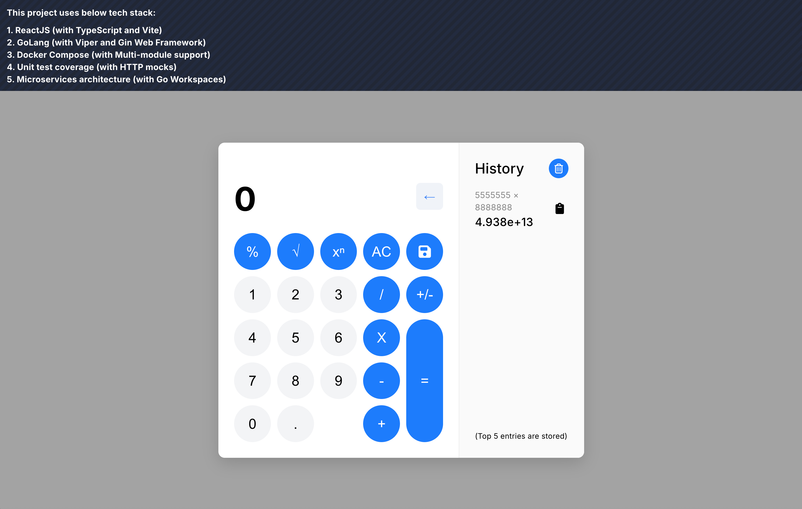

## Full-Stack Calculator App

Note: This project is an assessment built for Sezzle.

### Project Details
Copyright
* Author: Erdem Savasci
* Date: 2026-04

Tech Stack:
1. ReactJS (TS & Vite)
2. GoLang (Multi-module & Workspace)

Note: JetBrains GoLand is used as an IDE.

### Screenshot

